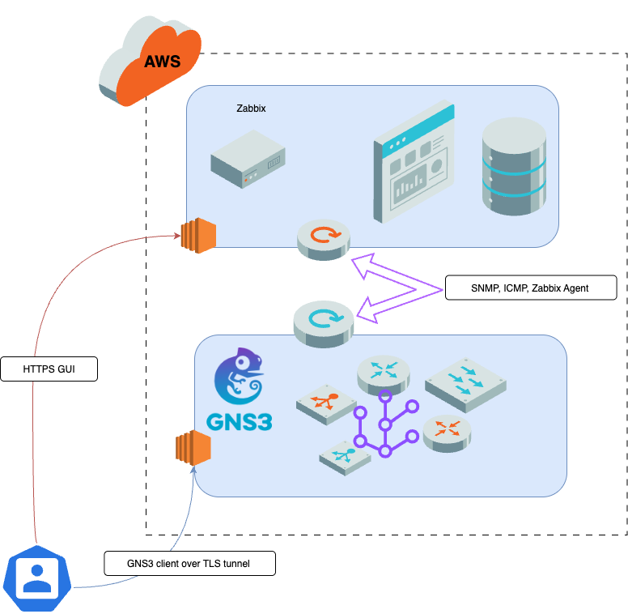
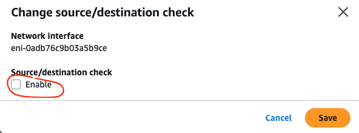
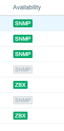
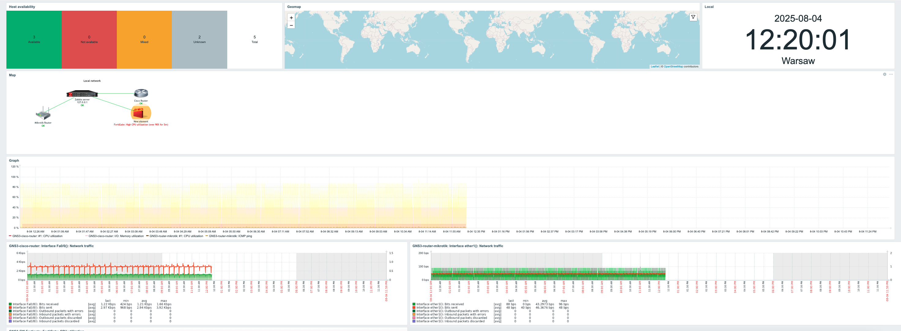

# Zabbix-GNS3-AWS
This lab helps you to build GNS3 lab on a remote server at the AWS add Zabbix and start monitor network elements from the GNS3 topology.



# GNS3 remote AWS server

## Install Remote GNS3 server


1) Firstly you would need to run EC2 instance. We will skip this part as you may use your own options, but for simplicity just choose
   + Recent Ubuntu image
   + t2.large or t2.xlarge should be enough
   + RAM 8GB+
   + Better to have something more then 16GB (32 or 64+) of storage
   + Highly recommended to add Elastic IP so you have you GNS3 always available with the same IP even after restarts
   + Do not forget to update Secure_groups with OpenVPN protocols
      - UDP 1194
      - TCP 8003
      - TCP 3080
      -  Some other ports like SSH(22), HTTP/HTTPS (80/443)
          
2) Those commands will allow you to install GNS3 and run the script to configure it with OpenVPN to secure your client-to-server connection

   ```
   cd /tmp
   ```
   Download install script from GNS3 git
   ```
   curl https://raw.githubusercontent.com/GNS3/gns3-server/master/scripts/remote-install.sh > gns3-remote-install.sh
   ```
   Run the script
   ```
   bash gns3-remote-install.sh --with-openvpn --with-iou --with-i386-repository
   ```
   > [!NOTE]
   > Those command may require ```sudo``` to be used

3) Now script will run everything you need. Once done: 
    Reboot
    ```
    sudo reboot now
    ```
    After reboot on a welcome screen you will find URL to grab your OpenVPN config file
    Now open your OpenVPN client and add config file
    Now you can connect. Be sure that your VPN is now active and you see "Connected"

## Configure GNS3 client

1) Your GNS3 client (assuming you have installed it already from the  [**official web site**](https://www.gns3.com/))
2) Now let's configure GNS3 client to connect to the AWS server
   + Go to the GNS3-->Preferences-->Server-->Be sure that "Enable local server" checkbox is unchecked
   + In the Host field just type your VPN IP address. You can find it on a welcome screen after OpenVPN installation. Usually it is 172.16.253.1
   + You can leave all other fields untouched 

## Build a Lab in GNS3

1) There are multiple way you can build a lab:
   + You can use GNS3 Marketplace to find Lab templates, appliances and software
      [**GNS3 Marketplace**](https://gns3.com/marketplace/featured)
   + You can find ready to use portable project *.gns3project or *.gns3p
   + You can build your our lab manually
2) In all cases at some point you will face a need of images for the vendor/product of choice. Those images are properties of the companies so you would be forced to go images at vendor's websites, support portal and so on.
3) My recommendation would be to choose open-source projects that can be easily find like vyos, zebra, nginx or to use some legacy cisco ios, fortigate that you can find in the Internet.
4) Building GNS3 lab is not exactly part of this guidance, so we are assuming you have you Lab ready to be monitored by Zabbix.
5) Last thing is to connect your GNS3 Lab to the AWS network. For that you can use "Cloud" connector in GNS3. Please attach any border router of your lab to the cloud and choose virbr0 interface of your GNS3 linux server.
   This is will connect your lab to the outside world. Please check important notes below:

> [!NOTE]
> Very important on this stage to allow AWS to forward traffic which is not part of AWS created interface IP space.
> So when hidden private network is used for GNS3 lab, traffic will be blocked by AWS unless you have specifically uncheck the box of Src/Dst check on Network Interface level




> [!NOTE]
> Another important thing is to enable traffic from outside to access GNS3 lab. There is FW entry you need to fix for that.
> ```
> sudo iptables -D LIBVIRT_FWI -o virbr0 -j REJECT --reject-with icmp-port-unreachable
> ```
> 

# Zabbix Server on AWS

## Zabbix installation

1) First, choose your platform and follow this link for AWS installation
   [Amazon Linux, PostgreSQL, Nginx](https://www.zabbix.com/download?zabbix=7.4&os_distribution=alma_linux&os_version=9&components=server_frontend_agent&db=pgsql&ws=nginx)
2) Follow the steps to install your Zabbix Server. in AWS don't forget to:
   + Choice appropriate server type. I would say not less than t3.medium
   + Open ports for incoming traffic in Security Groups like GUI, SNMP, ICMP, TLS:
     - TCP 8080
     - UDP 161
     - ICMP
     - TCP 443, 22, 8003
3) Once installed you should be able to access GUI by the 8080 port.

## Zabbix configuration

1) Now we need to add our monitoring nodes
   + Monitoring --> Hosts --> Create Host
   + Choose IP address and Interface: Agent or SNMP
2) Once added you will start seeing your hosts in green in the availability column.
   
   

3) Now you can start to create your dashboard and maps. This what you can have as a very simplified example

   


